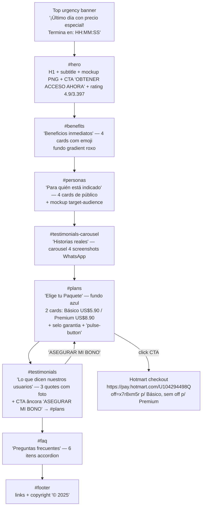

# Pages Map — actividadesadultosmayores.com

> **Tipo:** Landing page de venda de produto digital (single-page, *long-form sales letter*). **Não é um quiz** — não há ramificações nem perguntas. Toda a experiência acontece em uma única rota (`/`) com âncoras internas.

## Rota única

- URL: `https://actividadesadultosmayores.com/`
- Idioma: `es` (espanhol — público LATAM)
- Título: `+100 Actividades y Ejercicios para Adultos Mayores | Material Imprimible`
- Destino final (checkout): `https://pay.hotmart.com/U104294498Q` (Hotmart)

## Estrutura das seções (top → bottom)

## Ramificações?

Nenhuma. É uma **landing linear**. Variações observadas:
- Dois CTAs distintos que vão a duas variantes de checkout Hotmart (parâmetro `off`):
  - **Básico** → `?off=x7r8xm5r` (oferta com desconto p/ US$5.90)
  - **Premium** → sem `off` (oferta default US$8.90 com bônus)

## Estados / interações capturadas

- **FAQ accordion**: cada item alterna `class="faq-answer"` ↔ `class="faq-answer active"`. Botão alterna texto `+` ↔ `-`. Comportamento simples (provavelmente listener inline ou em JS bundled — não foi exposto).
- **Carousel de testemunhos** (WhatsApp screenshots): setas `‹` / `›` + dots. Transform translateX nos slides, transition `.5s ease-in-out`.
- **Countdown** no top banner: contador regressivo HH:MM:SS, texto fixo em espanhol.
- **Pulse animation** no CTA premium (`@keyframes pulse-button`): scale 1→1.02→1 com box-shadow expanding em verde (`#4ade80`).
- **Sticky CTA bar** definida no CSS (`.sticky-cta` fixed bottom) — não visível no snapshot inicial, provavelmente injetada via JS após scroll (não chegou a aparecer durante a captura).
- **Purchase notifications** definidas no CSS (`.purchase-notification` slide-in/out 6s) — toasts no canto superior direito simulando compras recentes, animação `slideInOut`.

## Anchors / âncoras internas

- `#plans` — usado pelo CTA "ASEGURAR MI BONO" para rolar até a seção de preços.
- `smooth-scroll` aplicado globalmente em `html { scroll-behavior: smooth }`.

## Variantes / A/B observadas

Apenas uma variante capturada. CSS contém classes legacy não usadas (`.plan-card`, `.plan-popular`, `.comparison-table`, `.testimonial-placeholder`) que sugerem versões anteriores do layout — a versão ativa usa `.plan-basic-new` e `.plan-premium-new`.
